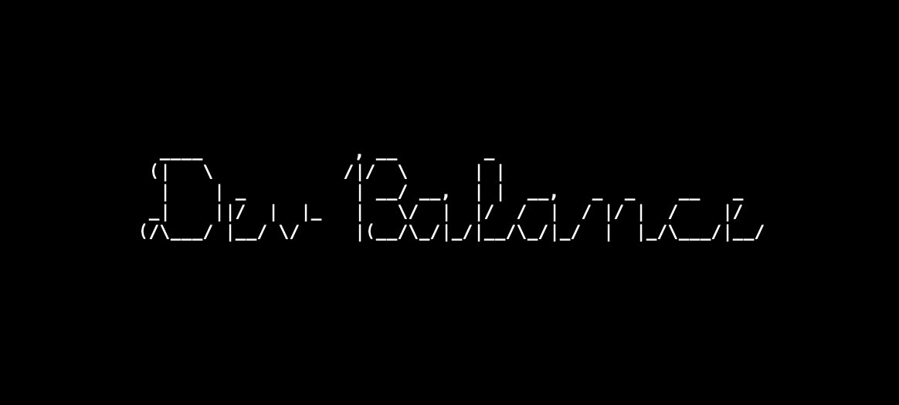

# Dev Balance


**Dev Balance** helps developers maintain healthy work habits by reminding them to take breaks during long coding sessions.  
It follows the Pomodoro technique by default, but durations are fully customizable.

## ✨ Features

- Start and track focused work sessions
- Automatically reminds you to take breaks
- Displays daily, monthly, and yearly reports
- Customizable timers for both work and breaks
- Optional sound notifications
- Keeps logs of your coding and break history

## 🧭 Status Bar Controls


⏱️ Track time while coding

🚫 Pause or 🎮 Resume the timer

♻️ Reset the current session

💡 View reports (daily, monthly, yearly)


## ⚙️ Settings

You can adjust the settings in your VS Code `settings.json`:

```json
{
  "devBalance.workDurationMinutes": 25,
  "devBalance.breakDurationMinutes": 5,
  "devBalance.enableSound": true
}
```

## 📊 Commands
Open the command palette (Ctrl+Shift+P or Cmd+Shift+P) and run:

- Dev Balance: Pause Timer
- Dev Balance: Resume Timer
- Dev Balance: Reset Timer
- Dev Balance: Show Daily Report
- Dev Balance: Show Monthly Report
- Dev Balance: Show Yearly Report
- Dev Balance: Clear All Logs


## 📦 Installation
Get it from the [Visual Studio Code Marketplace](https://marketplace.visualstudio.com/items?itemName=sinaebadi.dev-balance).


You can use `devBalance` even on [Cursor](https://www.cursor.sh/) — the AI-first editor based on VS Code.

Just open Cursor/VSCode, go to the Extensions panel, and search: 
##### dev balance
Or run the command:
```bash
ext install sinaebadi.devbalance
```


## 🤝 Contributing

Contributions are welcome!  
Feel free to fork the repo, submit pull requests, or open issues to improve Dev Balance together.
